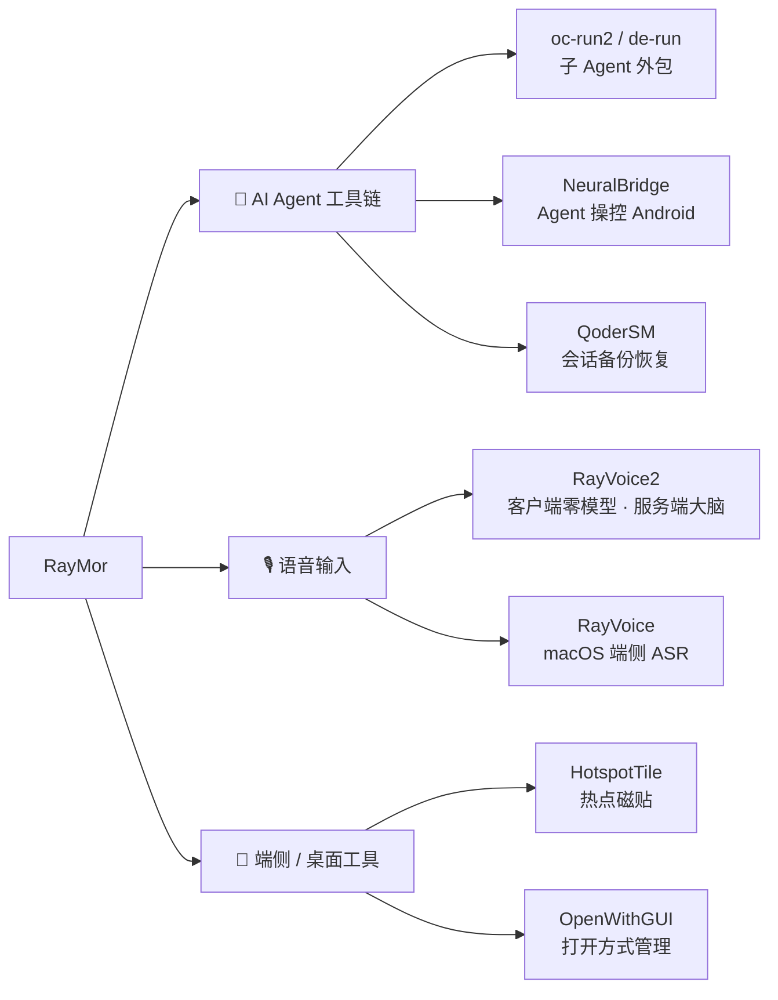

> [English](./README_en.md) | **简体中文**

# RayMor · Ray

**哈工大（威海）软件工程在读 · 造 AI Agent 工具链、语音输入与端侧工具 —— 先自用，再开源。**

---

## 关于我

我在哈尔滨工业大学（威海）读软件工程。做过的项目大多有一个共同起点：**自己先被某件小事烦到，然后把它做成工具。** 于是这条线上长出了两类东西——一类把重复劳动从人手里挪给 AI Agent，一类把 AI 塞回端侧设备，让"能自动化"重新变得隐私、可控、离线可用。

除了写代码，我也喜欢帆船、航拍和摄影——但在这个主页里，先把工程讲清楚。

## 关注方向

- **AI Agent 工具链** —— 把主 Agent 最贵的上下文留给决策，把"读一大堆、只想要一个结论"的粗活外包给独立子 Agent；也让 Agent 通过 MCP 直接操控端侧设备。
- **语音输入** —— 把"说完即见字"钉进桌面与手机：端侧 ASR 换隐私与延迟，服务端大脑换模型可热更。
- **端侧工具** —— 不改系统、不要 root、尽量离线，把被厂商或系统藏起来的能力还给用户。

---

## 精选项目

### 🧩 AI Agent 工具链

**oc-run2 — 把 OpenCode 2 变成任意 Harness 的子 Agent**
主 Agent 负责指挥、子 Agent 负责干活。子 Agent 可用任意模型（DeepSeek / GLM / Kimi / 免费档），一次最多并行 6 个，结束后回一张含 session、tokens 与 cost（美元）的结构化汇总。
`Python` · `OpenCode 2` · `MIT`
→ [RayMorTwinkle/oc-run2](https://github.com/RayMorTwinkle/oc-run2)

**de-run — 把华为 DevEco Code 变成子 Agent**
与 oc-run2 同款用法，底层换成华为 DevEco Code：登录华为账号即用免费 GLM-5.1 通道，把"通读鸿蒙文档 / 陌生仓库"的活外包出去，零模型费。
`Python` · `HarmonyOS` · `MIT`
→ [RayMorTwinkle/de-run](https://github.com/RayMorTwinkle/de-run)

**NeuralBridge — 让任意 AI Agent 直接操控 Android**
把自动化能力塞进手机 App：内置 Ktor CIO HTTP MCP 服务器（端口 `7474`），由端侧 `AccessibilityService` 在本进程内执行手势、读 UI 树、截图。无需 root，平均 ~6.4ms。
`Kotlin` · `MCP` · `Apache-2.0`
→ [RayMorTwinkle/NeuralBridge_mcp](https://github.com/RayMorTwinkle/NeuralBridge_mcp)

**QoderSM — Qoder 会话管理器**
Qoder IDE 按身份隔离本地会话，换号即"整片消失"。一键备份 / 恢复 / 导出这些历史对话，提供 CLI / Web / 桌面 / 菜单栏四端。
`Go` · `macOS` · `SQLite + JSONL`
→ [RayMorTwinkle/QoderSM](https://github.com/RayMorTwinkle/QoderSM)

### 🎙️ 语音输入

**RayVoice2 — 悦我语音输入**
客户端是哑终端，服务端是大脑：桌面用全局热键、安卓用悬浮球 + 无障碍，不抢输入法。转写 / 润色 / 翻译 / 按选中文本改写全部在服务端，模型与 prompt 可热更、客户端不发版。
`Electron + React` · `Kotlin` · `Python FastAPI`
→ [RayMorTwinkle/RayVoice2](https://github.com/RayMorTwinkle/RayVoice2)

**RayVoice — 悦我输入法（macOS）**
F9 说完，光标处直接出现整理好的书面文字：本地 ASR（sherpa-onnx Zipformer）+ LLM 流式整理 + 打字机注入，原文先上屏、整理稿随后无缝替换。
`Rust` · `sherpa-onnx` · `macOS`
→ [RayMorTwinkle/RayVoice](https://github.com/RayMorTwinkle/RayVoice)

### 🧷 端侧 / 桌面工具

**HotspotTile — 把被藏起来的 WiFi 热点开关还给用户**
很多平板把「个人热点 / WLAN 共享」从快捷面板抹掉了。桌面一键直达 + 控制中心磁贴真开关，免 Root 直接开热点（Android ≤ 15），不联网、零第三方依赖。
`Kotlin` · `Android`
→ [RayMorTwinkle/HotspotTile](https://github.com/RayMorTwinkle/HotspotTile)

**OpenWithGUI — macOS「打开方式」统一管理器**
用一张表看清并批量改掉全系统默认应用，告别逐个扩展名地"显示简介 → 打开方式 → 全部更改"。
`Swift` · `macOS 14+`
→ [RayMorTwinkle/OpenWithGUI2](https://github.com/RayMorTwinkle/OpenWithGUI2)

> **更多项目**：[CodeCenter](https://github.com/RayMorTwinkle/CodeCenter)（装进 Android 的 AI 编程工作站）、[issue-triage-bot](https://github.com/RayMorTwinkle/issue-triage-bot)（LLM 值守 GitHub Issues 的自反馈流水线）、[tabby-rayremote-link](https://github.com/RayMorTwinkle/tabby-rayremote-link)（把本地 Tabby 终端借给云端）、[archify-pure](https://github.com/RayMorTwinkle/archify-pure)（代码仓库 → 离线可交互系统地图）、[prisma_note](https://github.com/RayMorTwinkle/prisma_note)、[DailyNews](https://github.com/RayMorTwinkle/DailyNews)、[ray-blog](https://github.com/RayMorTwinkle/ray-blog)。

---

## 项目地图

---

## 技术栈

| 层 | 常用 |
|---|---|
| 语言 | TypeScript · Python · Rust · Go · Kotlin · Swift · Dart |
| 前端 | React · Vue 3 · Next.js · Astro · Three.js · Tailwind CSS |
| 后端 | FastAPI · Node.js · tRPC · Prisma · PostgreSQL · SQLite |
| 端侧 / 移动 | Android（Kotlin + Compose）· Flutter · proot · AccessibilityService |
| AI / Agent | MCP · LLM API（流式）· ASR（sherpa-onnx）· OpenCode · 多 Agent 编排 |

---

## 联系

- **GitHub**：[@RayMorTwinkle](https://github.com/RayMorTwinkle)
- **博客**：[blog.raymor.top](https://blog.raymor.top/)
- **邮箱**：raymor@raymor.top

> 对上面的项目感兴趣、想一起做点东西，或者只是想聊聊——欢迎来聊 👋

---

"Ship it, then make it better."

