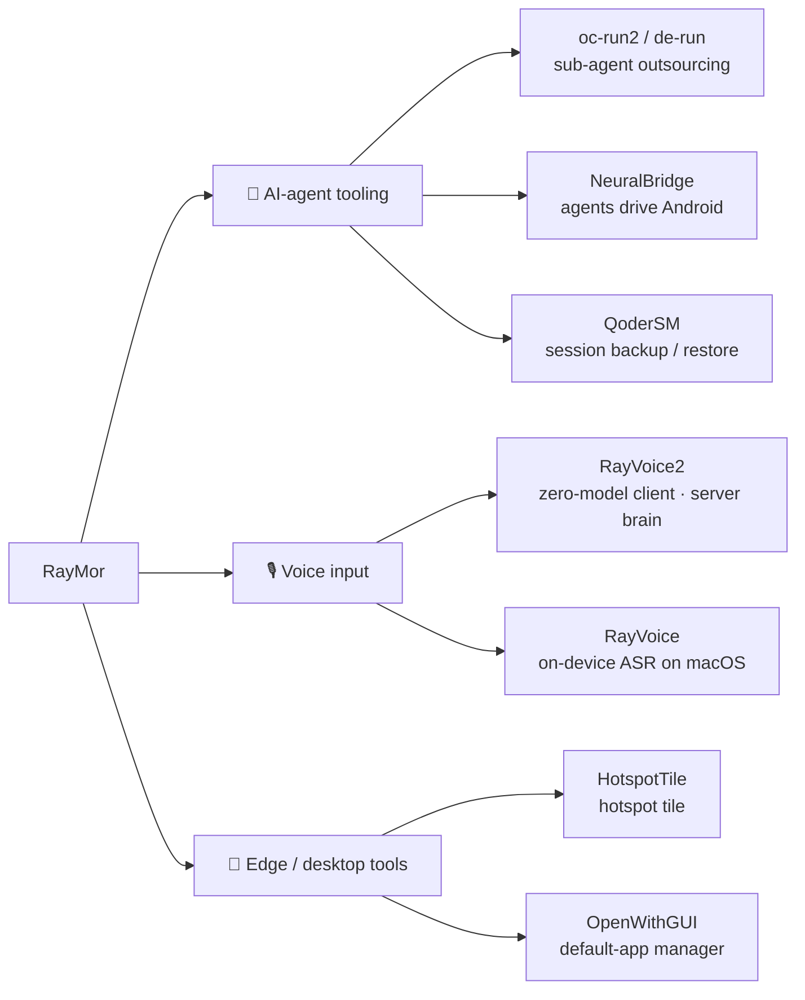

> [English](./README_en.md) | **简体中文**

# RayMor · Ray

**Software Engineering @ HIT (Weihai) · I build AI-agent tooling, voice input, and edge-side tools — first for myself, then for everyone.**

---

## About me

I study Software Engineering at Harbin Institute of Technology, Weihai. Most of my projects start the same way: **something annoys me just enough that I turn it into a tool.** That habit has grown two kinds of things — tools that move repetitive work off my hands and onto AI agents, and tools that push AI back onto edge devices so that "automated" can mean private, controllable, and offline again.

Outside of code I sail, fly drones, and shoot photos — but on this page, let's keep it about the engineering.

## Focus

- **AI-agent tooling** — Keep the main agent's expensive context for decisions, and outsource the "read a lot, want one conclusion" grunt work to independent sub-agents. Also: let agents drive edge devices directly over MCP.
- **Voice input** — Pin "speak and it appears" onto desktop and mobile: on-device ASR buys privacy and latency, a server-side brain buys hot-swappable models.
- **Edge tools** — No system hacks, no root, offline whenever possible — give users back the abilities that vendors or the OS hid away.

---

## Selected projects

### 🧩 AI-agent tooling

**oc-run2 — Turn OpenCode 2 into a sub-agent for any harness**
The main agent commands, sub-agents do the work. Sub-agents can use any model (DeepSeek / GLM / Kimi / free tiers), up to 6 run in parallel, and everything ends in a structured summary with session, tokens, and cost (USD).
`Python` · `OpenCode 2` · `MIT`
→ [RayMorTwinkle/oc-run2](https://github.com/RayMorTwinkle/oc-run2)

**de-run — Turn Huawei DevEco Code into a sub-agent**
Same usage as oc-run2, backed by Huawei DevEco Code: log in with a Huawei account for a free GLM-5.1 channel, and outsource "read the entire HarmonyOS docs / an unfamiliar repo" at zero model cost.
`Python` · `HarmonyOS` · `MIT`
→ [RayMorTwinkle/de-run](https://github.com/RayMorTwinkle/de-run)

**NeuralBridge — Let any AI agent drive Android directly**
Automation lives inside a phone app: a built-in Ktor CIO HTTP MCP server (port `7474`) executes gestures, reads the UI tree, and takes screenshots in-process via `AccessibilityService`. No root, ~6.4ms average.
`Kotlin` · `MCP` · `Apache-2.0`
→ [RayMorTwinkle/NeuralBridge_mcp](https://github.com/RayMorTwinkle/NeuralBridge_mcp)

**QoderSM — Session manager for Qoder**
Qoder IDE isolates local chat sessions per identity, so switching accounts makes them vanish wholesale. Back up / restore / export those histories in one click, across CLI / Web / desktop / menu bar.
`Go` · `macOS` · `SQLite + JSONL`
→ [RayMorTwinkle/QoderSM](https://github.com/RayMorTwinkle/QoderSM)

### 🎙️ Voice input

**RayVoice2 — Voice input that never takes over your keyboard**
Clients are dumb terminals, the server is the brain: a global hotkey on desktop, a floating bubble + accessibility on Android. Transcription / polishing / translation / rewrite-with-selection all run server-side, so models and prompts hot-update without shipping a new client.
`Electron + React` · `Kotlin` · `Python FastAPI`
→ [RayMorTwinkle/RayVoice2](https://github.com/RayMorTwinkle/RayVoice2)

**RayVoice — Voice input method (macOS)**
Press F9, speak, and polished text appears at your cursor: on-device ASR (sherpa-onnx Zipformer) + streaming LLM cleanup + typewriter injection. Raw text first, cleaned version swapped in seamlessly after.
`Rust` · `sherpa-onnx` · `macOS`
→ [RayMorTwinkle/RayVoice](https://github.com/RayMorTwinkle/RayVoice)

### 🧷 Edge / desktop tools

**HotspotTile — Give users back the WiFi hotspot toggle**
Many tablets erase "Personal Hotspot / WLAN Sharing" from the quick panel. One-tap from the desktop plus a real Quick Settings tile toggle, no root (Android ≤ 15), no network, zero third-party deps.
`Kotlin` · `Android`
→ [RayMorTwinkle/HotspotTile](https://github.com/RayMorTwinkle/HotspotTile)

**OpenWithGUI — A unified "Open With" manager for macOS**
See and batch-change system-wide default apps in one table — no more per-extension "Get Info → Open With → Change All…".
`Swift` · `macOS 14+`
→ [RayMorTwinkle/OpenWithGUI2](https://github.com/RayMorTwinkle/OpenWithGUI2)

> **More**: [CodeCenter](https://github.com/RayMorTwinkle/CodeCenter) (an AI coding workstation inside Android), [issue-triage-bot](https://github.com/RayMorTwinkle/issue-triage-bot) (a self-feedback LLM pipeline guarding GitHub Issues), [tabby-rayremote-link](https://github.com/RayMorTwinkle/tabby-rayremote-link) (lend your local Tabby terminal to the cloud), [archify-pure](https://github.com/RayMorTwinkle/archify-pure) (turn a repo into an offline, interactive system map), [prisma_note](https://github.com/RayMorTwinkle/prisma_note), [DailyNews](https://github.com/RayMorTwinkle/DailyNews), [ray-blog](https://github.com/RayMorTwinkle/ray-blog).

---

## Project map

---

## Tech stack

| Layer | Tools |
|---|---|
| Languages | TypeScript · Python · Rust · Go · Kotlin · Swift · Dart |
| Frontend | React · Vue 3 · Next.js · Astro · Three.js · Tailwind CSS |
| Backend | FastAPI · Node.js · tRPC · Prisma · PostgreSQL · SQLite |
| Edge / mobile | Android (Kotlin + Compose) · Flutter · proot · AccessibilityService |
| AI / agents | MCP · LLM APIs (streaming) · ASR (sherpa-onnx) · OpenCode · multi-agent orchestration |

---

## Contact

- **GitHub**: [@RayMorTwinkle](https://github.com/RayMorTwinkle)
- **Blog**: [blog.raymor.top](https://blog.raymor.top/)
- **Email**: raymor@raymor.top

> Interested in the projects, want to build something together, or just want to chat — happy to hear from you 👋

---

"Ship it, then make it better."

